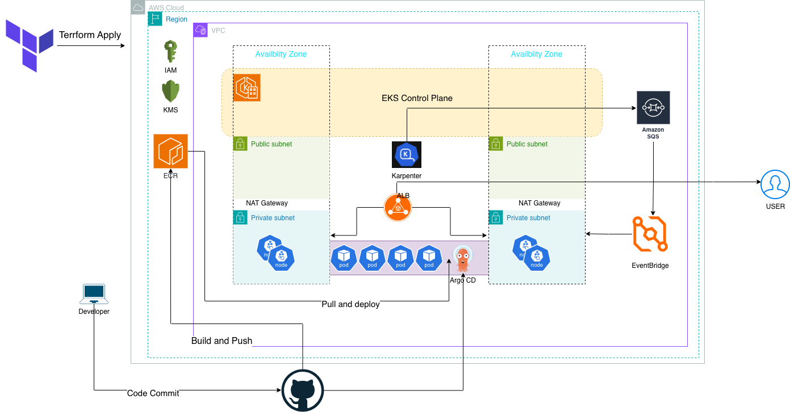

# Production Ready Platform on Amazon EKS

This project demonstrates a production-ready Kubernetes platform built on **Amazon EKS** using Infrastructure as Code, GitOps, CI/CD, and automatic node provisioning.

The platform is completely automated using Terraform and GitHub Actions and includes secure IAM integration, Kubernetes autoscaling, GitOps deployment with ArgoCD, and dynamic node provisioning using Karpenter.

---

# Architecture

The following diagram illustrates the end-to-end platform architecture, from code commit through CI/CD, GitOps deployment, Kubernetes orchestration, and autoscaling with Karpenter.

<p align="center">
  
</p>

## High-Level Flow

```
                   GitHub
                      │
                      ▼
             GitHub Actions
          (Build & Push Image)
                      │
                      ▼
                 Amazon ECR
                      │
                      ▼
                  ArgoCD (GitOps)
                      │
                      ▼
                 Amazon EKS Cluster
        ┌──────────────────────────────────┐
        │                                  │
        │ AWS Load Balancer Controller      │
        │ Metrics Server                    │
        │ EBS CSI Driver                    │
        │ Karpenter                         │
        │                                  │
        └──────────────────────────────────┘
                      │
                      ▼
              Application Pods
                      │
                      ▼
             AWS Application Load Balancer
                      │
                      ▼
                   Internet
```

---

# Features

- Infrastructure as Code using Terraform
- Modular Terraform architecture
- Multi-environment deployment (Dev / Prod)
- Amazon EKS
- Custom VPC
- Private & Public Subnets
- NAT Gateway
- VPC Endpoints
- AWS KMS Encryption
- IAM Roles
- IRSA (IAM Roles for Service Accounts)
- AWS Load Balancer Controller
- AWS EBS CSI Driver
- Metrics Server
- Karpenter
- EC2NodeClass
- NodePool
- Amazon ECR
- GitHub Actions CI/CD
- Kustomize
- ArgoCD GitOps
- Horizontal Pod Autoscaler
- Automatic Node Provisioning

---

# Repository Structure

```
.
├── app
│   ├── Dockerfile
│   ├── go.mod
│   └── main.go
│
├── infra
│   ├── backend
│   ├── environments
│   │   ├── dev
│   │   └── prod
│   └── modules
│       ├── addons
│       ├── eks
│       ├── iam
│       ├── irsa
│       ├── karpenter
│       ├── kms
│       └── vpc
│
├── gitops
│   └── karpenter
│
├── kustomize
│   ├── base
│   └── overlays
│
├── argocd
│
└── .github
    └── workflows
```

---

# Infrastructure Components

## Networking

- Custom VPC
- Public Subnets
- Private Subnets
- Internet Gateway
- NAT Gateway
- Route Tables

---

## Security

- AWS KMS
- IAM Least Privilege
- IRSA
- Security Groups
- Private Worker Nodes

---

## Kubernetes

Amazon EKS Cluster

- Managed Node Group
- Launch Templates
- Cluster Logging
- OIDC Provider

---

## Kubernetes Addons

### AWS Load Balancer Controller

Provides:

- Application Load Balancer
- Ingress Support

---

### Metrics Server

Provides resource metrics for

- HPA
- kubectl top

---

### AWS EBS CSI Driver

Provides dynamic Persistent Volumes.

---

### Karpenter

Provides:

- Automatic Node Provisioning
- Node Consolidation
- Spot / On-Demand Support
- EC2NodeClass
- NodePool

---

# Terraform Modules

| Module | Description |
|---------|-------------|
| backend | Remote Terraform State |
| vpc | Networking |
| kms | Encryption |
| iam | IAM Roles |
| irsa | IAM Roles for Service Accounts |
| eks | Kubernetes Cluster |
| addons | Kubernetes Addons |
| karpenter | Node Autoscaler |

---

# Deployment Flow

```
Terraform

↓

AWS Infrastructure

↓

EKS

↓

Terraform Helm

↓

AWS Controllers

↓

Application Deployment
```

---

# CI/CD Pipeline

GitHub Actions performs:

- Go Build
- Docker Build
- Push to Amazon ECR
- Update Image Tag
- Commit Manifest
- Trigger GitOps Deployment

---

# GitOps Flow

```
Developer Push

↓

GitHub Actions

↓

Amazon ECR

↓

Update Kustomize

↓

Git Commit

↓

ArgoCD

↓

Deployment
```

---

# Application

Simple Go HTTP API

Endpoints

```
/

GET /?name=Kamran

Response

Hello Kamran!
```

Health Endpoints

```
/healthz

/readyz
```

---

# Kubernetes Resources

Deployment

- 2 Replicas
- Resource Limits
- Resource Requests
- Readiness Probe
- Liveness Probe

---

Service

ClusterIP

---

Ingress

AWS Application Load Balancer

---

Horizontal Pod Autoscaler

```
Min Replicas : 2

Max Replicas : 10

CPU Target : 70%
```

---

# Karpenter Configuration

## EC2NodeClass

- AL2023
- GP3 Storage
- Encrypted Volumes
- Instance Profile
- Automatic Subnet Discovery
- Automatic Security Group Discovery

---

## NodePool

Supports

- On Demand
- C Family
- M Family
- R Family

Automatic Consolidation

---

# Autoscaling Flow

```
Traffic

↓

HPA

↓

More Pods

↓

Pending Pods

↓

Karpenter

↓

NodeClaim

↓

New EC2 Instance

↓

Pods Scheduled
```

---

# Container Image

Image Repository

Amazon ECR

Image Build

GitHub Actions

---

# Technologies Used

- Terraform
- AWS
- Amazon EKS
- Docker
- Kubernetes
- Go
- Helm
- GitHub Actions
- Amazon ECR
- Karpenter
- ArgoCD
- Kustomize

---

# Prerequisites

- AWS CLI
- Terraform
- kubectl
- Helm
- Docker
- GitHub Account

---

# Deploy Infrastructure

```
cd infra/environments/dev

terraform init

terraform plan

terraform apply
```

---

# Deploy Application

```
kubectl apply -k kustomize/overlays/dev
```

---

# Verify

```
kubectl get nodes

kubectl get pods

kubectl get ingress

kubectl get hpa

kubectl get nodepool

kubectl get ec2nodeclass
```

---

# Testing

```
curl http://<ALB-DNS>

curl http://<ALB-DNS>?name=OpenAI
```

---

# Demonstrating Autoscaling

Increase replicas

```
kubectl scale deployment hello-api --replicas=30
```

Watch

```
kubectl get pods -w

kubectl get nodeclaims -w

kubectl get nodes -w
```

Scale Down

```
kubectl scale deployment hello-api --replicas=2
```

Observe Karpenter removing unused nodes.

---

# Future Improvements

- GitHub OIDC Authentication
- AWS Secrets Manager Integration
- External DNS
- Cert Manager
- HTTPS using ACM
- Prometheus
- Grafana
- Loki
- Fluent Bit
- Velero Backup
- Kyverno Policies
- Trivy Security Scanning
- SonarQube
- Multi Region Deployment

---

# Author

Kamran Ansari

Senior DevOps / Platform Engineer

Specializations

- AWS
- Azure
- Kubernetes
- Terraform
- GitOps
- Platform Engineering
- CI/CD
